## CI/CD Pipeline Deployment

The source codes and other resources for for the application deployed can be found in this **[link here](https://github.com/ibrahima1289/DEPLOY_08_CICD)**.

👉Link to deployment instructions: [here](https://github.com/kura-labs-org/DEPLOY_08_CICD/blob/main/Deployment%208.pdf)

### Goal: 

The goal for this assignment is to create three EC2 instances with [Ansible](https://www.ansible.com/), and set up a CI/CD pipeline that will build build a docker image of the app, test the application using [Cypress](https://www.cypress.io/how-it-works); and deploy with Jenkins. Finaly, the image will be uploaded to Dockerhub using the Jenkins pipeline.

### Architecture:

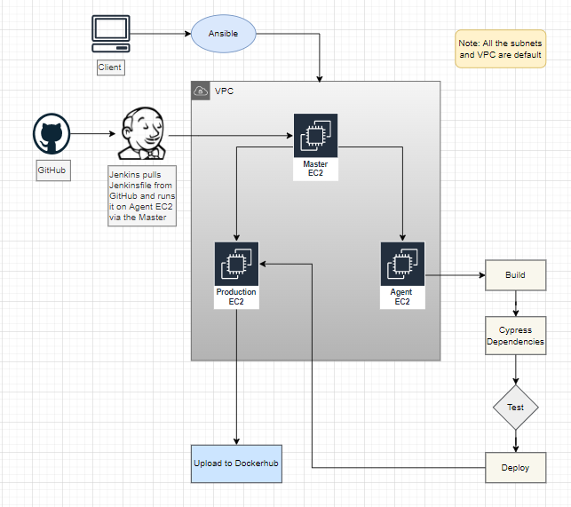

### Software Tools:

In this project, we used AWS services and other software listed below.

1. GitHub
2. Jenkins
3. Docker
4. Ansible
5. Cypress

### Procedure:

#### Task 1: 

1. Create three EC2 instance using Ansible:
  * One EC2 will be a Jenkins master
  * The second EC2 is a Jenkins agent 
  * And the third you will use for production.
In order to accomplish this first step, we will use the Ansible yaml file called [ec2_creator.yml](https://github.com/ibrahima1289/DEPLOY_08_CICD/blob/main/ansible_playbooks/ec2_creator.yml).

Make sure Ansible is installed. You can follow this [guide](https://docs.ansible.com/ansible/latest/installation_guide/index.html).

Then verify the installation:

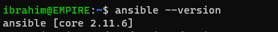

Make a directory and `cd` in it:

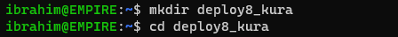

Run `aws configure` in order to set up your AWS credentials and fill in the information so that Ansible can create resources in your AWS account.

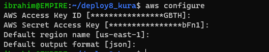

Now, run the Ansible playbook: `ansible-playbook ec2_creator.yml -v`<br>
The `-v` is to get more information while the yaml file is creating the resources.

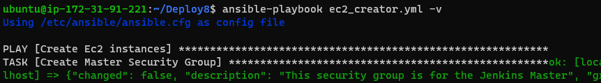

You should see at the end:

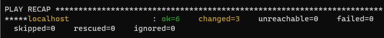

2. Once the EC2 instances are created, configure each one of them.
  * On the first EC2 also known as Master, install Jenkins using this [install_jenkins.sh](https://github.com/ibrahima1289/DEPLOY_08_CICD/blob/main/ansible_playbooks/install_jenkins.sh) bash file.
      * First, `ssh` into the EC2.
      * Run ```sudo nano install_jenkins.sh```, and copy the content of the file [install_jenkins.sh](https://github.com/ibrahima1289/DEPLOY_08_CICD/blob/main/ansible_playbooks/install_jenkins.sh) and paste it in the file
      * Click `Control+X`, then `Y`, then `Enter`.
      * Run ```sudo chmod +x install_jenkins.sh``` to make the file executable.
      * Run ```./install_jenkins.sh```. Make sure you are in the direcetory that contain the file `install_jenkins.sh`. Otherwise, indicate the path.
      * Once done, you will see the `initialAdminPassword` at the bottom. Save it.
      * Open a new browser and run ```public_ip_of_ec2_master:8080```, you will see:

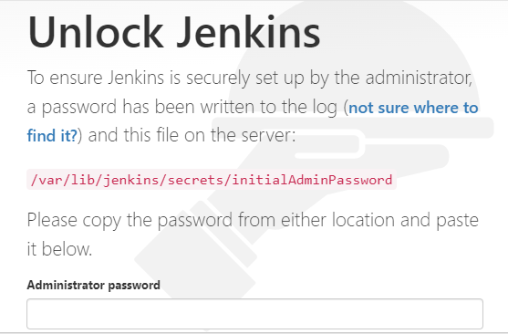

      * Paste the `initialAdminPassword`. And follow the instructions.
      
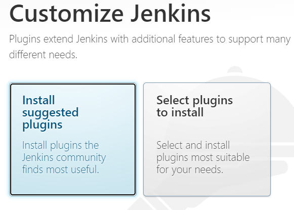

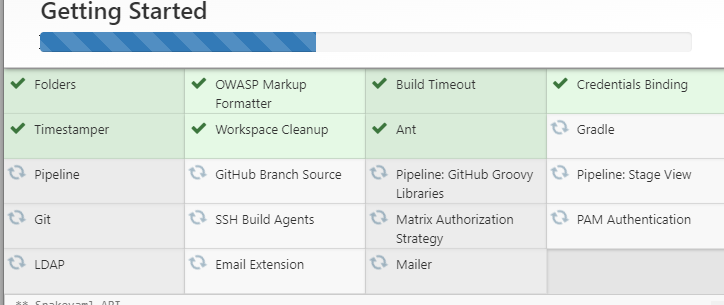

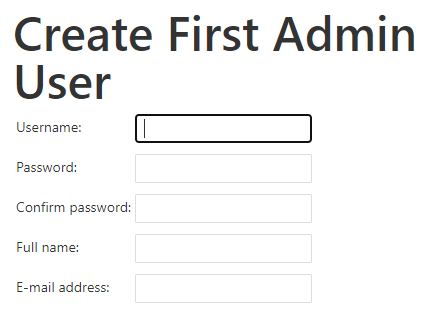

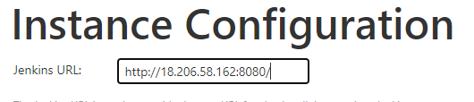

      
  * After you logged in into the Master, create nodes for the other two EC2 instances. You can find it [here](https://github.com/kura-labs-org/DEPLOY5_AWS/blob/main/Deployment%235.pdf) how to set up an agent.

[](images/d8-16.PNG)

  * On the second EC2 which is the agent, install the dependencies using the file [agent_dependences.sh](https://github.com/ibrahima1289/DEPLOY_08_CICD/blob/main/ansible_playbooks/agent_dependences.sh)
  * On the third EC2, install docker (this will be for the application). You can use this [install_docker.sh](https://github.com/ibrahima1289/DEPLOY_08_CICD/blob/main/ansible_playbooks/install_docker.sh).

#### Task 2:


#### Task 3:


#### Task 4:


#### Task 5: 

### Sources visited:

1. https://awsbloglink.wordpress.com/2020/05/14/ansiblejenkins2020en/
2. https://medium.com/nerd-for-tech/installing-jenkins-using-an-ansible-playbook-2d99303a235f
3. https://linuxize.com/post/how-to-install-jenkins-on-ubuntu-20-04/
4. https://www.middlewareinventory.com/blog/ansible-aws-ec2/
5. https://geektechstuff.com/2020/07/07/using-ansible-with-aws-creating-multiple-ec2-instances-tagging-them-and-elk-aws-ansible/

  

